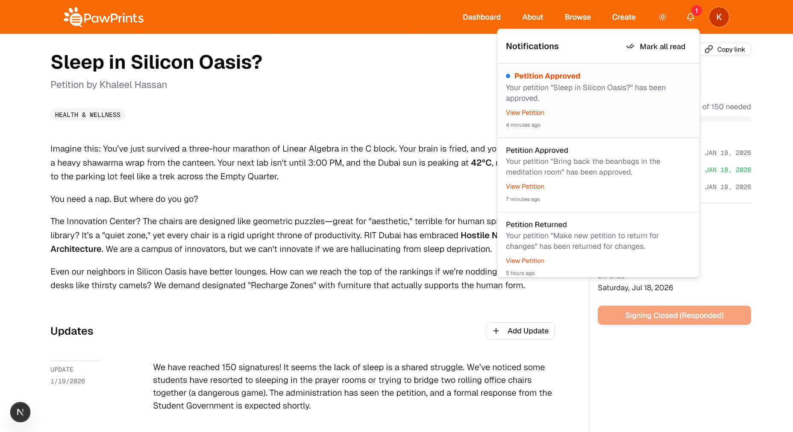

# PawPrints

[PawPrints](https://pawprints.ritdubai.ae) is a petition platform built for the [RIT Dubai](https://rit.edu/dubai) community (based on the actual [PawPrints](https://pawprints.rit.edu)) to allow members of the RIT Dubai community to submit, sign, and share petitions with the administration. This project is built using Next.js 15, utilizing PostgreSQL for storing all the awesome stuff like petitions, and Firebase for authentication.

Here's a list of cool features we currently have:
- Create, edit, and manage petitions with rich text support using Quill.js
- User authentication via Google OAuth (RIT accounts only) or email/password accounts issued by us
- Sign petitions and track your signatures
- Admin dashboard for managing petitions and users
- Responsive design for mobile and desktop
- Dark mode support that respects system preferences
- Granular permission controls for users, staff, and admins; we did it like how Linux does it
- In-app notifications for petition updates (that also respect your preferences)
- Canonical URLs for petitions to improve sharing and SEO, with dynamic meta tags for better link previews
- Helps prevent spam and abuse with rate limiting and input validation
- Handle external links with user alerts to ensure safety, powered by Google Safe Browsing
- Amazing DX with tools like Prisma to help manage the database schema and migrations
- And so much more that we're planning to add, see [TODO.md](TODO.md)!



## How it looks under the hood

```mermaid
graph TD
    classDef client fill:#bbdefb,stroke:#0d47a1,stroke-width:2px,color:#000;
    classDef server fill:#e1bee7,stroke:#4a148c,stroke-width:2px,color:#000;
    classDef db fill:#ffcc80,stroke:#e65100,stroke-width:2px,color:#000;
    classDef external fill:#c8e6c9,stroke:#1b5e20,stroke-width:2px,color:#000;

    subgraph Client ["Client Layer"]
        UI["React Components (Shadcn UI)"]
        AuthHook["Firebase Auth Hook"]

        subgraph AuthFlow ["Authentication Flow"]
            Popup["SignInWithPopup"]
            Redirect["SignInWithRedirect"]
            Fallback{"Popup Fails?"}

            Popup -->|Success| GetToken["Get ID Token"]
            Popup -->|Error| Fallback
            Fallback -->|Yes| Redirect
        end

        UI --> AuthFlow
        UI -->|Interactions| ServerActions
    end

    subgraph NextJS ["Next.js Server Layer"]
        direction TB

        subgraph MiddlewareLayer ["Middleware"]
            MW["middleware.ts"]
            AuthEdge["next-firebase-auth-edge"]
            MW --> AuthEdge
        end

        subgraph Config ["Configuration"]
            NextConfig["next.config.ts"]
            AuthProxy["Rewrite: /__/auth/* ➔ firebaseapp.com"]
            NextConfig --> AuthProxy
        end

        subgraph ServerActions ["Server Actions"]
            ActionCreate["createPetition"]
            ActionSign["signPetition"]
            ActionGet["getPetition"]
            ActionVerify["verifyExternalLink"]

            Sanitizer["Sanitize HTML"]
            LinkProcessor["Link Processor"]

            ActionCreate --> Sanitizer
            ActionGet --> LinkProcessor
            ActionVerify --> LinkProcessor
        end

        subgraph BusinessLogic ["Business Logic"]
            SB_Lib["src/lib/safe-browsing.ts"]
            LinkCheck{"In Cache?"}

            LinkProcessor --> SB_Lib
            SB_Lib --> LinkCheck
            LinkCheck -->|Hit| DB_Cache
            LinkCheck -->|Miss| Ext_SafeBrowsing
        end
    end

    subgraph Database ["PostgreSQL (Prisma)"]
        direction TB

        Prisma["Prisma Client"]

        subgraph Users ["User Management"]
            DB_User[("User")]
            DB_NotifSettings[("NotificationSettings")]
            DB_Notification[("Notification")]
            DB_AuditLog[("AuditLog")]
        end

        subgraph Petitions ["Petition Data"]
            DB_Petition[("Petition")]
            DB_Tag[("Tag")]
            DB_Response[("Response")]
            DB_Update[("Update")]
            DB_Report[("Report")]
        end

        subgraph System ["System Data"]
            DB_GlobalAlert[("GlobalAlert")]
            DB_Cache[("LinkSafetyCache")]
        end

        Prisma --> DB_User
        Prisma --> DB_Petition
        Prisma --> DB_Cache

        DB_User -.-> DB_Petition
        DB_User -.-> DB_NotifSettings
        DB_Petition -.-> DB_Response
        DB_Petition -.-> DB_Update
        DB_Petition -.-> DB_Tag
        DB_Petition -.-> DB_Report
    end

    subgraph External ["External Services"]
        Firebase["Firebase Auth"]
        Ext_SafeBrowsing["Google Safe Browsing API"]
    end

    AuthHook -- "1. Auth" --> Firebase
    Redirect -- "2. Proxy Request" --> AuthProxy
    AuthProxy -- "3. Forward" --> Firebase
    AuthEdge -- "4. Validate Cookie" --> Firebase
    ServerActions -- "5. DB Query" --> Prisma
    LinkCheck -- "6. API Lookup" --> Ext_SafeBrowsing

    class UI,AuthHook,Popup,Redirect,GetToken client;
    class MW,AuthEdge,NextConfig,AuthProxy,ActionCreate,ActionSign,ActionGet,ActionVerify,SB_Lib,Sanitizer,LinkProcessor server;
    class DB_User,DB_NotifSettings,DB_Notification,DB_AuditLog,DB_Petition,DB_Tag,DB_Response,DB_Update,DB_Report,DB_GlobalAlert,DB_Cache,Prisma db;
    class Firebase,Ext_SafeBrowsing external;
```



---

## Getting Started

### Prerequisites

Make sure you have Node.js v20.x or higher installed. You will also need access to a PostgreSQL database and a Firebase project for authentication.

### Clone the repository

```bash
git clone https://github.com/ritsg/pawprints.git
cd pawprints
```

### Install dependencies

```bash
npm install
# or
yarn install
# or
bun install # we love bun here at RIT Dubai
```

### Configure environment variables

Clone the `.env.example` file to `.env` and fill in the required environment variables.

```bash
cp .env.example .env
```


### Setting up your database

Once your `.env` is configured with a valid `DATABASE_URL`, run the following commands to set up the database schema.

```bash
# Generate Prisma Client
npm run prisma:build
# prisma generate

# Push schema to database (for development)
npm run prisma:push
# prisma db push
```

#### How to seed data (mock dev data)

To populate the database with initial tags, mock users, and example petitions, run the seed script:

```bash
npx prisma db seed
```

This will run `prisma/seed.ts` and create standard tags, mock users, and mock petitions in various states. 
Make sure to remove or modify mock data before deploying to production.

### Run the development server!

```bash
npm run dev
```

Open [http://localhost:3000](http://localhost:3000) with your browser to see the result.

## Database & Prisma

We use Prisma as our ORM. The schema is located at `prisma/schema.prisma`.

After modifying `schema.prisma`, run:
```bash
npx prisma db push
npm run prisma:build
```

To view your database in a GUI:
```bash
npx prisma studio
```

To wipe the database and re-seed:
```bash
npx prisma migrate reset
```

## Firebase Setup

### Authentication
We currently use Google OAuth (theoretically, Microsoft would work too, from the rit.edu domain) to authenticate as members of the RIT community, until we get access to Shibboleth and implement SAML, which is also doable with Firebase. To make sure only RIT users can login, we also make sure the Google Cloud Project associated with the Firebase project only allows users from the same organization (g.rit.edu) to sign in. Checkout this [StackOverflow thread](https://stackoverflow.com/questions/64765394/how-can-i-enable-the-internal-option-in-the-oauth-consent-screen) on how to do that.

## UI & Theming

### Shadcn UI
Components are located in `src/components/ui`. To add a new component (e.g., button):
```bash
npx shadcn@latest add button
```


## Deploying to prod

Make sure to set your environment variables in production. Set `USE_SECURE_COOKIES` to `true` in production.

### Database Migrations in Prod
Modifying in production is a bad idea in the first place, but in the unlikely scenario that you have to, it is recommended to use `prisma migrate deploy` instead of `db push` to apply schema changes safely.

```bash
npx prisma migrate deploy
```


## License

MIT license, see [LICENSE.md](LICENSE.md) for more details.
